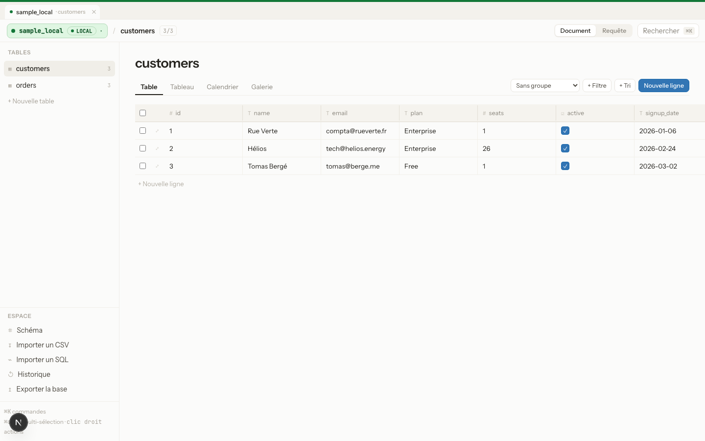
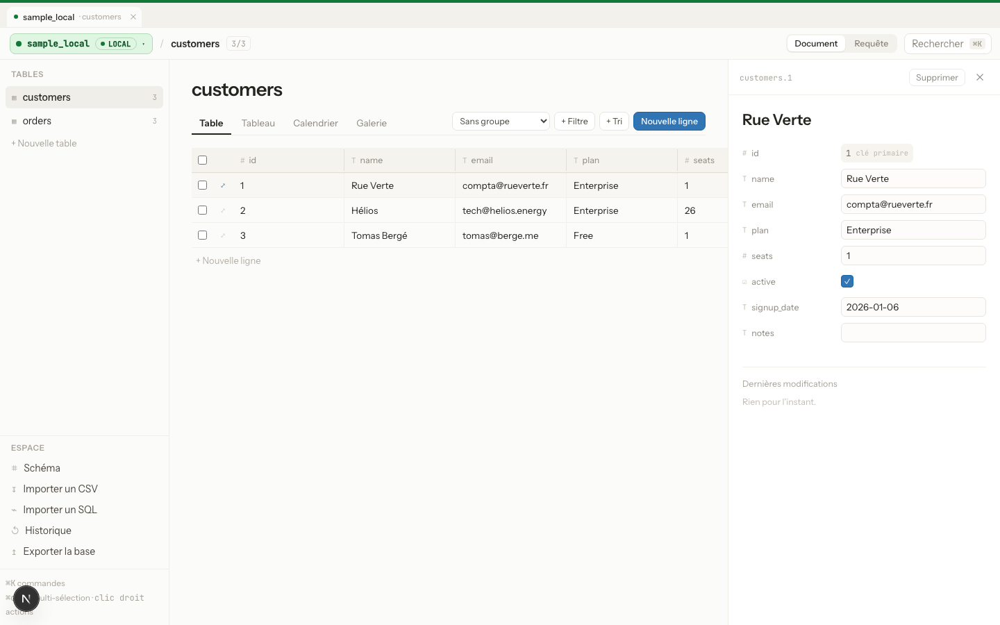
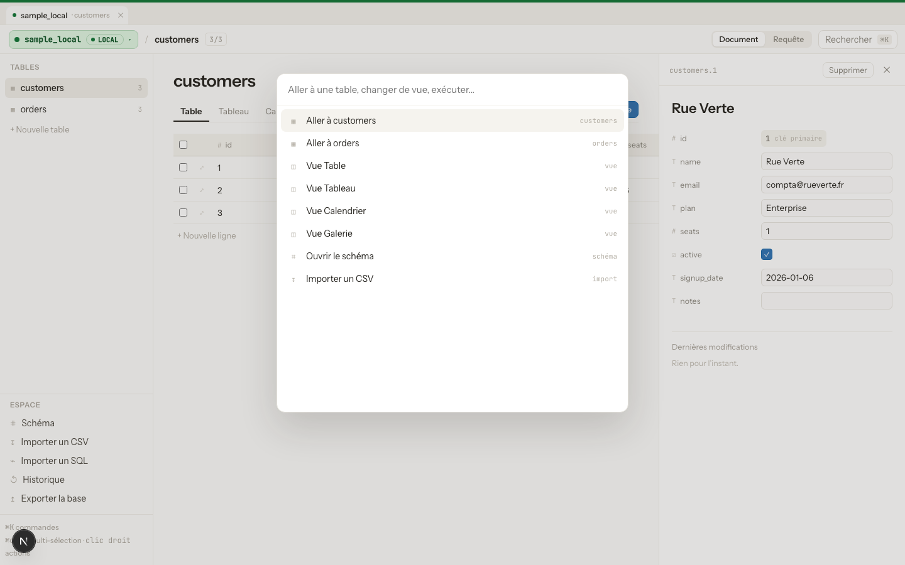
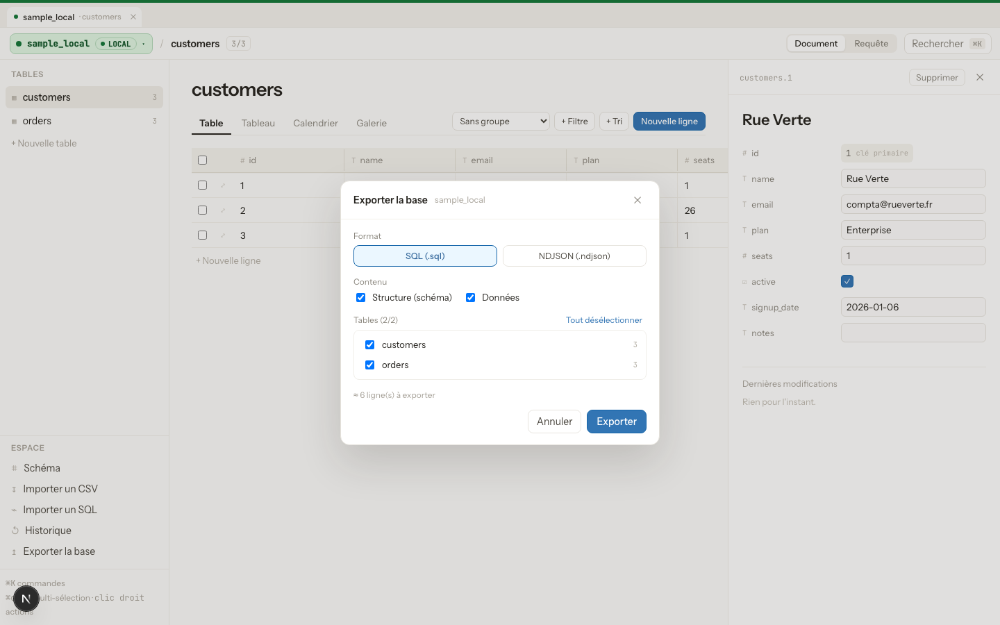
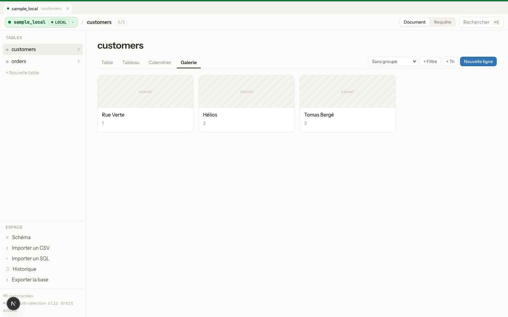
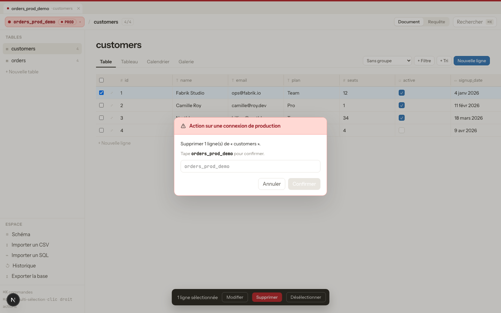

Un éditeur de base de données open-source, 100% web, avec l'UI/UX d'un outil
type Notion — et un principe simple : **on ne doit jamais pouvoir confondre
une base locale et une base de production.**



## Sommaire

- [Fonctionnalités](#fonctionnalités)
- [Aperçu](#aperçu)
- [Prérequis](#prérequis)
- [Installation](#installation)
- [Configuration (`.env`)](#configuration-env)
- [Bases de données de test](#bases-de-données-de-test)
- [Déploiement en production](#déploiement-en-production)
- [Sécurité et limites connues](#sécurité-et-limites-connues)
- [Licence](#licence)

## Fonctionnalités

- **Connexions multiples** — PostgreSQL, MySQL et SQLite, chacune taguée par
  environnement (Local / Dev / Staging / Prod / Custom).
- **Indicateur de connexion toujours visible** — badge coloré en permanence
  dans la barre du haut + liseré de couleur sur tout le viewport (rouge pour
  la prod), avec un switcher listant toutes les connexions enregistrées.
- **Garde-fous sur la production** — toute suppression de ligne, suppression/
  changement de type de colonne, ou requête SQL d'écriture sur une connexion
  taguée « prod » exige de taper le nom de la connexion pour confirmer. Le
  panneau Schéma est en lecture seule par défaut sur ces connexions.
- **4 vues** sur chaque table : Table (grille éditable), Tableau (kanban),
  Calendrier, Galerie — plus filtres, tri et regroupement.
- **Édition de schéma réelle** : ajout/renommage/suppression de colonne,
  changement de type (vrais `ALTER TABLE`).
- **Import CSV**, **console SQL** (mode Requête, lecture seule par défaut),
  **palette de commandes** (⌘K), **historique des modifications avec
  annulation**.

## Aperçu

| | |
|---|---|
| **Vue Table** — grille éditable, colonnes redimensionnables/réordonnables |  |
| **Panneau de détail** — édition d'une ligne, redimensionnable |  |
| **Palette de commandes** (⌘K) — navigation clavier |  |
| **Export** — SQL/NDJSON, structure/données, sélection des tables |  |
| **Vue Galerie** |  |
| **Garde-fou sur la production** — confirmation par saisie du nom de la connexion |  |

## Prérequis

- **Node.js 20+**
- Pour les bases de test uniquement : **Docker** et **Docker Compose**
- Aucune base de données externe requise pour démarrer — Overlook fonctionne
  directement avec SQLite si tu n'as rien d'autre sous la main.

## Installation

```bash
git clone <url-du-dépôt>
cd overlook
npm install
npm run dev
```

Ouvre [http://localhost:3000](http://localhost:3000). Aucune base externe
n'est requise pour démarrer : les connexions que tu crées sont stockées dans
un fichier SQLite local (`data/app-metadata.db`), chiffrées au repos.

## Configuration (`.env`)

Copie `.env.example` en `.env` pour personnaliser (les deux variables sont
optionnelles, des valeurs par défaut sûres s'appliquent sinon) :

| Variable | Rôle | Défaut |
|---|---|---|
| `APP_SECRET` | Clé de chiffrement (AES-256-GCM) des mots de passe de connexion stockés sur disque. | Générée et stockée dans `data/secret.key` au premier lancement. |
| `DATA_DIR` | Dossier contenant le fichier de métadonnées (`app-metadata.db`) et la clé secrète. | `./data` |

**En production, définis toujours `APP_SECRET` explicitement** (une valeur
aléatoire longue, ex. `openssl rand -hex 32`) et garde-la stable : si elle
change, les mots de passe de connexion déjà chiffrés deviennent illisibles.

## Bases de données de test

Un `docker-compose.yml` fournit un Postgres et un MySQL de développement,
pré-remplis avec un petit schéma d'exemple :

```bash
docker compose up -d
```

- Postgres : `localhost:5433`, base `atlas_dev`, utilisateur/mot de passe `atlas`/`atlas`
- MySQL : `localhost:3307`, base `atlas_dev`, utilisateur/mot de passe `atlas`/`atlas`

(Ports décalés de leurs valeurs par défaut pour ne pas entrer en conflit avec
une instance déjà installée sur ta machine.)

Pour SQLite, un fichier d'exemple peut être généré avec :

```bash
node dev/seed-sqlite.js
```

## Déploiement en production

Overlook stocke ses connexions dans un fichier SQLite local (`data/app-metadata.db`)
: il faut donc un **hôte au filesystem persistant** (VPS, conteneur avec volume,
serveur Node classique) — pas de plateforme serverless comme Vercel, dont le
filesystem est éphémère.

### Option A — Node classique (VPS, serveur dédié…)

```bash
npm ci
npm run build
APP_SECRET=<clé-longue-et-stable> npm run start
```

Mets `npm run start` derrière un process manager (`pm2`, `systemd`) et un
reverse proxy TLS (nginx, Caddy).

### Option B — Docker

Le `Dockerfile` fourni construit une image de production (build multi-étapes,
sortie `standalone` de Next.js) :

```bash
docker build -t overlook .
docker run -d \
  -p 3000:3000 \
  -e APP_SECRET=<clé-longue-et-stable> \
  -v overlook-data:/app/data \
  --name overlook \
  overlook
```

Le volume `overlook-data` conserve les connexions enregistrées (et la clé de
chiffrement si `APP_SECRET` n'est pas fourni) d'un redémarrage à l'autre.

## Sécurité et limites connues

- **Pas de contrôle d'accès intégré.** Cet outil est pensé pour un usage en
  environnement de confiance (poste local ou réseau privé). Ne l'expose pas
  publiquement sans ajouter une couche d'authentification.
- Les mots de passe des connexions sont chiffrés (AES-256-GCM) avant d'être
  écrits sur disque. La clé de chiffrement vient de la variable d'environnement
  `APP_SECRET` si elle est définie, sinon une clé est générée et stockée dans
  `data/secret.key` au premier lancement.
- Le stockage des connexions repose sur un fichier SQLite local : idéal pour
  de l'auto-hébergement (Docker, serveur Node), mais ce fichier ne persiste
  pas entre invocations sur une plateforme serverless au filesystem éphémère
  (ex. Vercel) — dans ce cas, il faudrait migrer ce stockage vers une base
  hébergée.
- Les requêtes de données utilisent des requêtes paramétrées ; les
  identifiants (tables/colonnes) sont toujours validés contre le schéma
  introspecté avant d'être injectés dans les instructions DDL.
- Les colonnes de type « formule » ne sont pas prises en charge (hors
  scope) ; les relations (clés étrangères) sont affichées mais pas éditables
  via un sélecteur dédié.

## Licence

MIT.
