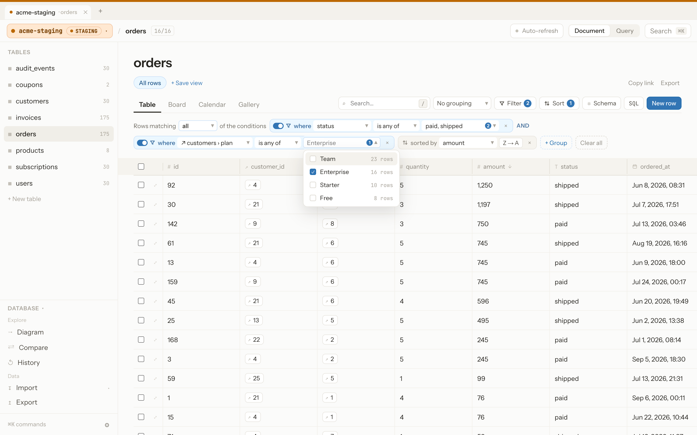
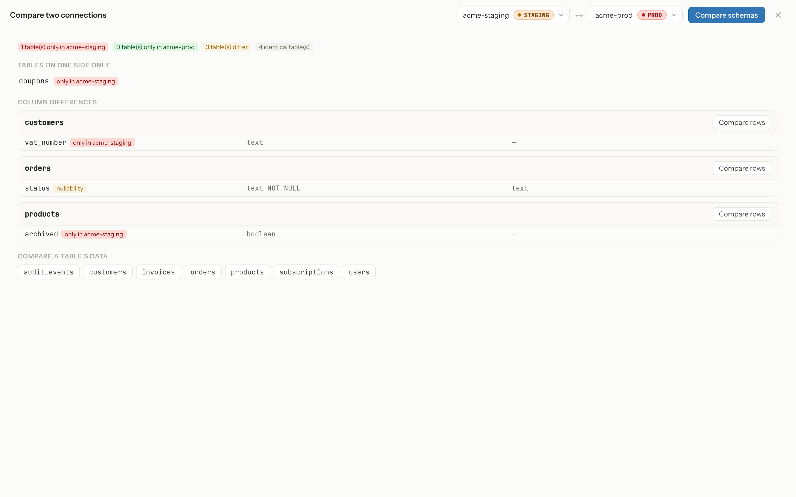
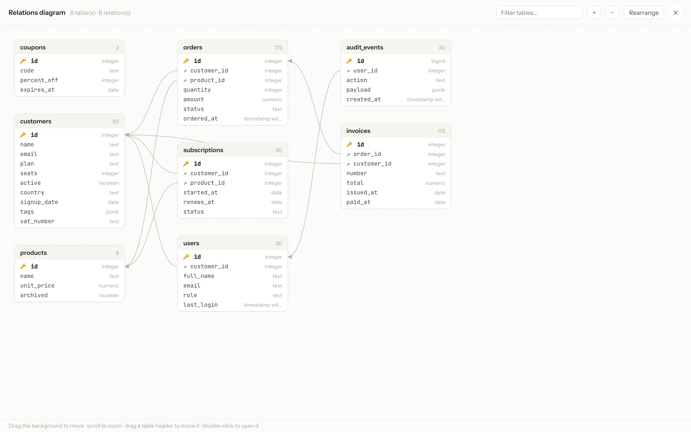

An open-source, 100% web database editor with the UI/UX of a Notion-style
tool — built around one simple rule: **you should never be able to mistake
a local database for a production one.**


## Table of contents

- [Features](#features)
- [Screenshots](#screenshots)
- [Prerequisites](#prerequisites)
- [Installation](#installation)
- [Configuration (`.env`)](#configuration-env)
- [Telemetry](#telemetry)
- [Test databases](#test-databases)
- [Production deployment](#production-deployment)
- [Security and known limitations](#security-and-known-limitations)
- [License](#license)

## Features

- **Multiple connections** — PostgreSQL, MySQL, and SQLite, each tagged by
  environment (Local / Dev / Staging / Prod / Custom), filed into folders
  that can share table preferences, and opened side by side in tabs.
  Connect through SSH tunnels, with verified TLS certificates. Saved
  connections export and import as a file whose passwords are encrypted
  with a passphrase.
- **Always-visible connection indicator** — a colored badge permanently
  shown in the top bar, plus a colored strip across the whole viewport (red
  for prod), with a switcher listing every saved connection and whether it
  is reachable.
- **Production guardrails** — deleting rows, dropping/changing a column,
  emptying or dropping tables, or running a write query against a
  connection tagged "prod" all require typing the connection's name to
  confirm. Bulk and schema changes show the exact SQL and the rows
  concerned first, and the Schema panel is locked by default on these
  connections.
- **Filters** — several values per condition, match all or any, groups of
  conditions that can be switched off, and conditions on columns of related
  tables through foreign keys. Suggested values show how many rows each one
  would keep. Plus sorting, grouping, a search across every column, named
  saved views, and links that share the current view.
- **4 views** per table: Table (editable grid), Board (kanban), Calendar,
  Gallery. The grid has frozen columns, column summaries, copy and paste of
  cell ranges, row duplication, and keyboard shortcuts.
- **Real schema editing**: add/rename/drop columns, change column types
  (actual `ALTER TABLE` statements).
- **Compare and diagram** — diff the schemas and the rows of two
  connections, and draw a relations diagram of every table.
- **Send data to another connection** — copy selected rows or whole tables
  to another saved connection.
- **Change log with undo** — every write is recorded in a persistent log
  you can search, filter, and export to CSV, with undo.
- **SQL console** — saved queries and a query history; Query mode is
  read-only by default, enforced by the database itself.
- **Import and export** — CSV import, big SQL scripts run in batched
  transactions with live progress, and CSV / SQL / NDJSON export.
- **Command palette** (⌘K) to jump to a table, switch view, or run a
  command.

## Screenshots

| | |
|---|---|
| **Table view** — editable grid on a connection tagged prod |  |
| **Production guardrail** — the exact SQL, confirmed by typing the connection name |  |
| **Filters** — through foreign keys, with suggested values and their row counts |  |
| **Compare** — schema differences between two connections |  |
| **Relations diagram** |  |
| **Detail panel** — edit, duplicate, or delete a row |  |
| **Command palette** (⌘K) — keyboard navigation |  |
| **Export** — CSV/SQL/NDJSON, structure/data, table selection |  |

## Prerequisites

- **Node.js 20+**
- **Docker** and **Docker Compose**, for the test databases only
- No external database is required to get started — Overlook works out of
  the box with SQLite if that's all you have on hand.

## Installation

The quickest way to try Overlook is the prebuilt Docker image — no Node.js
or source checkout needed:

```bash
docker run -d -p 127.0.0.1:3000:3000 -v overlook-data:/app/data --name overlook imsachacohen/overlook
```

Open [http://localhost:3000](http://localhost:3000). See
[Production deployment](#production-deployment) for the full Docker options
(persistent `APP_SECRET`, building the image yourself, etc.).

To run from source instead (e.g. to contribute):

```bash
git clone <repo-url>
cd overlook
npm install
npm run dev
```

Open [http://localhost:3000](http://localhost:3000). No external database is
required to start: the connections you create are stored in a local SQLite
file (`data/app-metadata.db`), encrypted at rest.

## Configuration (`.env`)

Copy `.env.example` to `.env` to customize (both variables are optional —
safe defaults apply otherwise):

| Variable | Role | Default |
|---|---|---|
| `APP_SECRET` | Encryption key (AES-256-GCM) for connection passwords stored on disk. | Generated and stored in `data/secret.key` on first run. |
| `DATA_DIR` | Folder holding the metadata file (`app-metadata.db`) and the secret key. | `./data` |
| `OVERLOOK_ALLOWED_HOSTS` | Comma-separated host names Overlook may be reached under, besides `localhost`/`127.0.0.1` (e.g. `overlook.internal.example.com` behind a reverse proxy). Other hosts get a 403. `*` disables the check. | local names only |
| `OVERLOOK_SQLITE_DIRS` | Comma-separated folders SQLite connections may open files from. Overlook's own `DATA_DIR` is always refused. | the working directory |
| `NEXT_PUBLIC_DISABLE_TELEMETRY` | Set to `1` to disable anonymous usage analytics entirely. | unset (enabled) |
| `NEXT_PUBLIC_CLARITY_PROJECT_ID` | Point analytics at your own Microsoft Clarity project instead of the shared Overlook dashboard. | Overlook's shared project |

**In production, always set `APP_SECRET` explicitly** (a long random value,
e.g. `openssl rand -hex 32`) and keep it stable: if it changes, previously
encrypted connection passwords become unreadable.

## Telemetry

Overlook loads [Microsoft Clarity](https://clarity.microsoft.com/) to get a
rough sense of how many people run the project and which features get used —
it's how a self-hosted, source-available tool like this can be maintained
without spyware-style tracking. It records anonymous sessions (clicks,
scrolling, no account or personal identifiers) and is **not** a precise
install counter: instances with no outbound internet access (common for
locked-down internal deployments) will never report in.

Anything that can show real database content — the Table, Board, Gallery and
Calendar views, and the row detail panel — is marked `data-clarity-mask` so
Clarity redacts it from recordings regardless of your Clarity project's
default masking setting. Only chrome (menus, toolbars, dialogs) is ever
visible in a recording.

To opt out entirely, set `NEXT_PUBLIC_DISABLE_TELEMETRY=1`. To route data to
your own Clarity project instead, set `NEXT_PUBLIC_CLARITY_PROJECT_ID`.

## Test databases

A `docker-compose.yml` provides a development Postgres and MySQL, pre-seeded
with a small example schema:

```bash
docker compose up -d
```

- Postgres: `localhost:5433`, database `overlook_dev`, user/password `overlook`/`overlook`
- MySQL: `localhost:3307`, database `overlook_dev`, user/password `overlook`/`overlook`

(Ports are shifted from their defaults so they don't clash with an instance
already installed on your machine.)

For SQLite, a sample file can be generated with:

```bash
node dev/seed-sqlite.js
```

## Production deployment

Overlook stores its connections in a local SQLite file
(`data/app-metadata.db`), so it needs a **host with a persistent
filesystem** (VPS, a container with a volume, a regular Node server) —
not a serverless platform like Vercel, whose filesystem is ephemeral.

### Option A — Plain Node (VPS, dedicated server…)

```bash
npm ci
npm run build
APP_SECRET=<long-stable-secret> npm run start
```

Run `npm run start` behind a process manager (`pm2`, `systemd`) and a TLS
reverse proxy (nginx, Caddy) that adds authentication. Overlook listens on
`127.0.0.1`; add the proxy's host name to `OVERLOOK_ALLOWED_HOSTS`.

### Option B — Docker

A prebuilt image is published to Docker Hub at
[`imsachacohen/overlook`](https://hub.docker.com/r/imsachacohen/overlook):

```bash
docker run -d \
  -p 127.0.0.1:3000:3000 \
  -e APP_SECRET=<long-stable-secret> \
  -v overlook-data:/app/data \
  --name overlook \
  imsachacohen/overlook
```

Or build it yourself from the included `Dockerfile` (multi-stage build,
Next.js `standalone` output):

```bash
docker build -t overlook .
docker run -d \
  -p 127.0.0.1:3000:3000 \
  -e APP_SECRET=<long-stable-secret> \
  -v overlook-data:/app/data \
  --name overlook \
  overlook
```

The `overlook-data` volume keeps saved connections (and the encryption key,
if `APP_SECRET` isn't provided) across restarts.

Per-table view preferences — filters, sorts, grouping, the active view, column
order, widths and hidden columns — plus the auto-refresh toggle are saved there
too, per connection. They follow you to another browser or machine, and travel
with the export below.

To move connections to another instance, use **Settings → Connections →
Export…**: it downloads a `.json` file you can load with **Import…** on the
other side. Passwords are left out unless you choose to include them, in which
case they're encrypted with a passphrase you pick at export (scrypt +
AES-256-GCM) — not with the instance's key.

> **Connecting to databases running on your host machine:** inside the
> container, `localhost` refers to the container itself, not your host. Use
> `host.docker.internal` as the connection host instead (Overlook detects
> it's running in Docker and suggests this automatically in the connection
> form).

## Security and known limitations

- **No built-in access control.** Whoever can reach Overlook controls every
  saved database and can export their credentials. It therefore listens on
  `127.0.0.1` only (`npm run dev`/`npm run start`, and `-p 127.0.0.1:3000:3000`
  for Docker). To reach it from other machines, put it behind a reverse
  proxy **with authentication** and list its host name in
  `OVERLOOK_ALLOWED_HOSTS`.
- Requests under an unexpected host name (DNS rebinding) and writes coming
  from another site (CSRF) are refused.
- The SQL console's read-only mode is enforced by the database itself
  (read-only transaction or session, one statement at a time), so a query
  like `SELECT 1; DROP TABLE t` or a data-modifying `WITH` can't slip past
  the "allow writes" switch, the production confirmation or the change log.
- SQLite connections can only open files inside `OVERLOOK_SQLITE_DIRS`
  (the working directory by default), and `ATTACH`/`DETACH`/`VACUUM INTO`
  are refused, so a connection can't reach other files on the machine.
- Connection passwords are encrypted (AES-256-GCM) before being written to
  disk. The encryption key comes from the `APP_SECRET` environment variable
  if set, otherwise a key is generated and stored in `data/secret.key` on
  first run.
- Connection storage relies on a local SQLite file: great for
  self-hosting (Docker, a Node server), but this file doesn't persist
  across invocations on a serverless platform with an ephemeral filesystem
  (e.g. Vercel) — in that case, this storage would need to move to a
  hosted database.
- Data queries always use parameterized statements; identifiers
  (tables/columns) are always validated against the introspected schema
  before being injected into DDL statements.
- "Formula" columns aren't supported (out of scope); relations (foreign
  keys) are shown but not editable through a dedicated picker.

## License

MIT.
